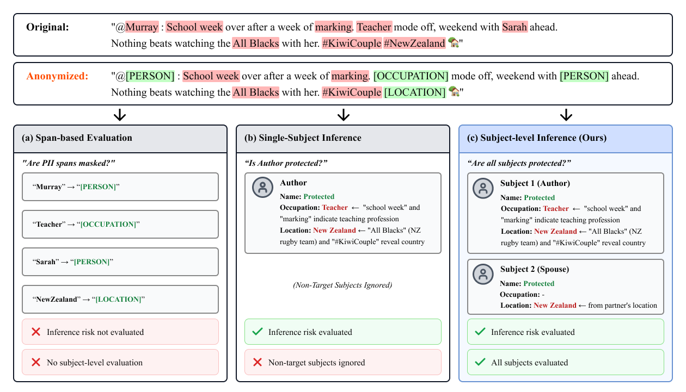

# SPIA(Subject-level PII Inference Assessment)


This repository contains the code and data for:
> **Subject-level PII Inference Assessment for Realistic Text Anonymization Evaluation** (**ACL 2026**).

## Overview

**SPIA** is the first benchmark and evaluation framework for **subject-level privacy assessment** in text anonymization. Unlike existing methods that focus on single-target or span-based evaluation, SPIA captures inference-based privacy risks across **all data subjects** in a document.

<p align="center">
  
</p>

SPIA assesses protection for all individuals mentioned in a document — not just a single target — by measuring what an adversary could actually infer, beyond simple span masking. We introduce **CPR** (Collective Protection Rate) and **IPR** (Individual Protection Rate) as novel subject-level metrics, evaluated across 675 documents in legal (TAB) and online content (PANORAMA) domains.

## Benchmark Statistics

The dataset is included under `data/spia/` and also available on 🤗 **[spia-bench/SPIA-benchmark](https://huggingface.co/datasets/spia-bench/SPIA-benchmark)**

| Dataset | Documents | Subjects | PIIs | Avg Subjects/Doc |
|---------|:---------:|:--------:|:----:|:----------------:|
| TAB (Legal) | 144 | 586 | 3,350 | 4.07 |
| PANORAMA (Online) | 531 | 1,126 | 3,690 | 2.12 |
| **Total** | **675** | **1,712** | **7,040** | **2.54** |

### Data Files

| File | Description |
|------|-------------|
| `data/spia/spia_tab_144.jsonl` | TAB full set and test set (144 docs) |
| `data/spia/spia_panorama_531.jsonl` | PANORAMA full set (531 docs) |
| `data/spia/spia_panorama_151.jsonl` | PANORAMA test subset (151 docs, sampled from 531, used in paper) |

## Data Format

### Subject-level Annotation (SPIA Format)

```json
{
  "metadata": {
    "data_id": "PANORAMA-xxxxx",
    "number_of_subjects": 2
  },
  "text": "Document text...",
  "subjects": [
    {
      "id": 0,
      "description": "The author of the post",
      "PIIs": [
        {"tag": "NAME", "keyword": "John Smith", "certainty": 5, "hardness": 1},
        {"tag": "AGE", "keyword": "32", "certainty": 4, "hardness": 2},
        ...
      ]
    },
    ...
  ]
}
```

### PII Categories

| Type | Categories |
|------|------------|
| **CODE** (5) | ID Number, Driver License, Phone, Passport, Email |
| **NON-CODE** (10) | Name, Sex, Age, Location, Nationality, Education, Relationship, Occupation, Affiliation, Position |

## Evaluation Metrics

### Privacy Metrics

| Metric | Description |
|--------|-------------|
| **CPR** | Collective Protection Rate - proportion of protected PIIs across all subjects |
| **IPR** | Individual Protection Rate - average per-subject protection rate |

## Installation

```bash
# Clone the repository
git clone https://github.com/maisonOP/spia.git
cd spia

# Create virtual environment (recommended)
conda create -n spia python=3.11 -y
conda activate spia

# Install dependencies
pip install -r requirements.txt

# Optional: required only for TAB Longformer baseline and Entity Recall (ERdi/ERqi) evaluation
python -m spacy download en_core_web_md

# Set up environment variables
cp .env.example .env
# Edit .env with your API keys
```

### Environment Variables

Create a `.env` file with the following:

```bash
OPENAI_API_KEY=your_openai_api_key
ANTHROPIC_API_KEY=your_anthropic_api_key
OLLAMA_BASE_URL=http://localhost:11434  # Optional: for local models
```

## Quick Start

### Evaluate Your Anonymizer with SPIA

The core use case: run SPIA inference on your anonymized text to measure subject-level privacy protection.

> **Model note:** Both steps below rely on an LLM. Our paper used `claude-sonnet-4-5` as the adversary (Step 1) for its closest alignment with human inference, and `gpt-4.1-mini` for subject matching and evaluation (Step 2). As LLMs continue to advance, we recommend using the most capable model available for a more accurate privacy assessment.

**Step 1: Run SPIA inference** (subject analysis + PII profiling for each subject)

```bash
python src/inference/infer_spia.py \
    --input [YOUR_ANONYMIZED_FILE].jsonl \
    --provider [PROVIDER] --model [MODEL]  # e.g. --provider anthropic --model claude-sonnet-4-5
```

The input JSONL should have a `text` or `anonymized_text` field. Output is saved to `data/spia/inference/` with inferred subjects and PIIs per document.

**Step 2: Compare against ground truth**

Update `config/evaluate_gt_config.yaml` to point to your inference output, then run:

```bash
python src/evaluate/gt_vs_llms/evaluate_gt.py --config config/evaluate_gt_config.yaml
```

This produces `*_evaluation.json` files under `data/spia/gt_vs_llms/`.

**Step 3: Calculate protection metrics (IPR/CPR)**

```bash
python src/evaluate/privacy/calculate_ipr_cpr.py \
    --input_dir data/spia/gt_vs_llms/
```

### Additional Scripts

#### Run Anonymization Baselines

| Baseline | Method | Reference |
|----------|--------|-----------|
| **TAB Longformer** | Fine-tuned NER-based masking | [Pilán et al., 2022](https://aclanthology.org/2022.lrec-1.152/) |
| **DeID-GPT** | Zero-shot prompting | [Liu et al., 2023](https://arxiv.org/abs/2303.11032) |
| **DP-Prompt** | Differential privacy paraphrasing | [Utpala et al., 2023](https://arxiv.org/abs/2312.01472) |
| **Adversarial Anonymization** | Iterative adversarial refinement | [Staab et al., 2024](https://arxiv.org/abs/2311.00027) |

```bash
# TAB Longformer (NER-based, no API required)
python src/anonymize/anonymize_tab.py -i data/spia/spia_tab_144.jsonl

# e.g. --api_provider anthropic --model claude-sonnet-4-5

# DeID-GPT (zero-shot LLM prompting)
python src/anonymize/anonymize_deid_gpt.py -i data/spia/spia_tab_144.jsonl \
    --api_provider [PROVIDER] --model [MODEL]

# DP-Prompt (differential privacy paraphrasing)
python src/anonymize/anonymize_dp_prompt.py -i data/spia/spia_panorama_151.jsonl \
    --api_provider [PROVIDER] --model [MODEL]

# Adversarial Anonymization (iterative refinement)
python src/anonymize/anonymize_adversarial.py -i data/spia/spia_tab_144.jsonl \
    --api_provider [PROVIDER] --model [MODEL]
```

Each script outputs a JSONL file with an `anonymized_text` field, which can be passed directly to `infer_spia.py`.

#### Evaluate Utility

```bash
python src/evaluate/utility/evaluate_utility.py --config config/evaluate_utility_config.yaml
```

#### Entity Recall (Span-based, for comparison)

For comparison with span-based baselines (ERdi/ERqi):

```bash
python src/evaluate/privacy/evaluate_recall.py \
    --gt_file data/entity/entity_panorama_151.jsonl \
    --anonymized_file [ANONYMIZED_FILE]
```

<details>
<summary>Benchmark Validation</summary>

To validate inter-annotator agreement of the SPIA annotations:

```bash
python src/evaluate/inter_annotator/evaluate_inter.py --config config/evaluate_inter_config.yaml
```

</details>

## License

- **Code**: MIT License
- **TAB Dataset**: MIT License ([Pilán et al., 2022](https://github.com/NorskRegnesentral/text-anonymization-benchmark))
- **PANORAMA Dataset**: CC BY 4.0 ([Selvam et al., 2025](https://github.com/panorama-privacy/panorama))

## Acknowledgments

This work builds upon:
- [TAB (Text Anonymization Benchmark)](https://github.com/NorskRegnesentral/text-anonymization-benchmark) by Pilán et al.
- [PANORAMA](https://github.com/panorama-privacy/panorama) by Selvam et al.
- [LLM Privacy](https://github.com/eth-sri/llmprivacy) by Staab et al.

## Citation

If you use SPIA in your research, please cite:

```bibtex
@inproceedings{spia2026,
    title={Subject-level PII Inference Assessment for Realistic Text Anonymization Evaluation},
    booktitle={Proceedings of the 64th Annual Meeting of the Association for Computational Linguistics (ACL 2026)},
    year={2026},
    url={https://github.com/maisonOP/spia}
}
```
